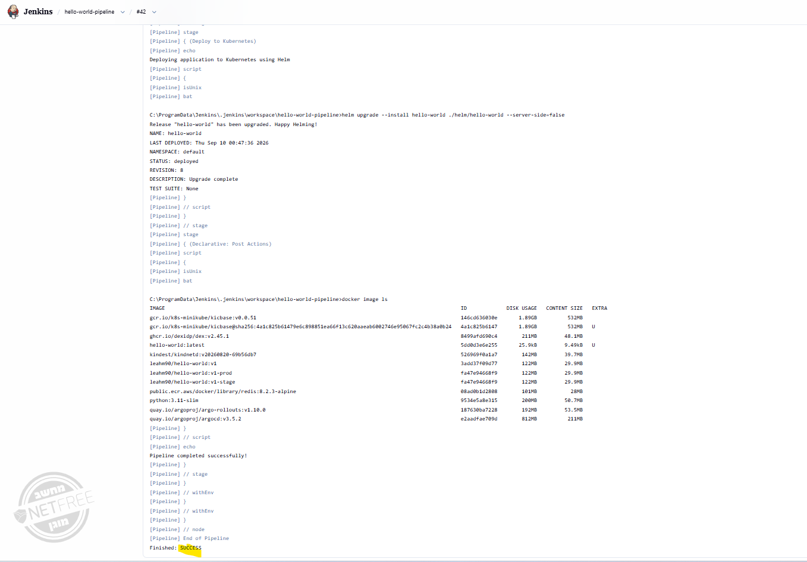
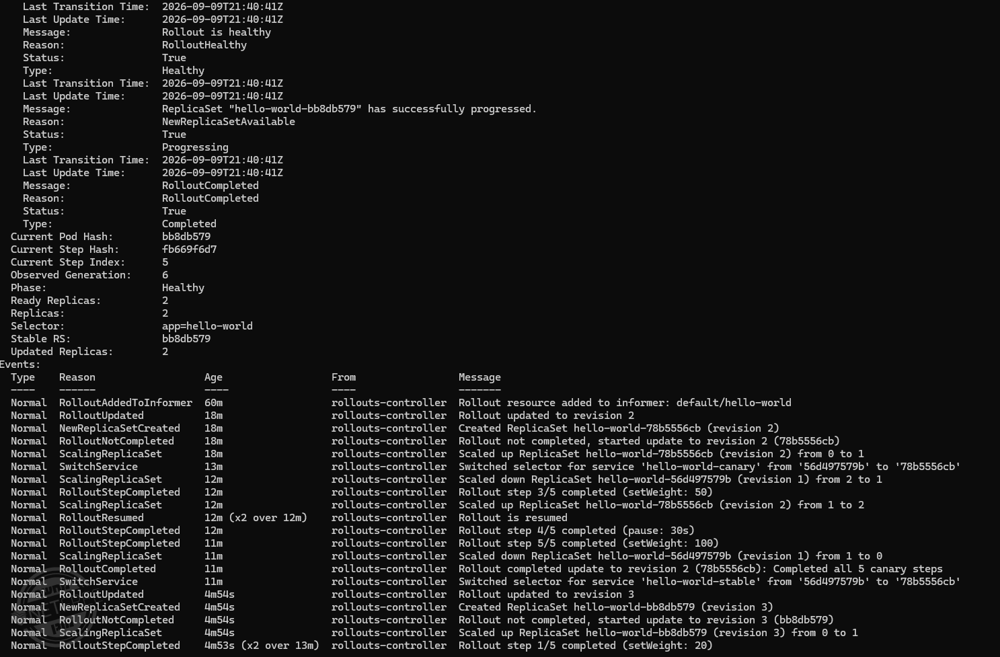
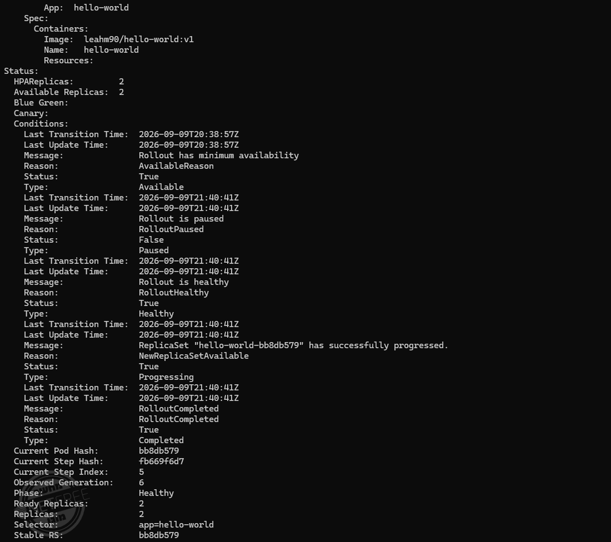

# Hello World - CI/CD & GitOps Pipeline

A simple Flask application deployed to Kubernetes through an automated Jenkins CI/CD pipeline and managed using GitOps with Argo CD.

The project demonstrates an end-to-end DevOps workflow including containerization, automated testing, security scanning, image publishing, Helm-based deployment, GitOps synchronization, progressive delivery with Argo Rollouts, and rollback.

---

## 🛠️ Tech Stack

* **Application:** Python · Flask
* **Containerization:** Docker
* **Container Registry:** Docker Hub
* **CI/CD:** Jenkins
* **Orchestration:** Kubernetes
* **Package Management:** Helm
* **GitOps:** Argo CD
* **Progressive Delivery:** Argo Rollouts
* **Security Scanning:** Trivy
* **Source Control:** GitHub
* **Local Kubernetes:** Minikube

---

## 📁 Project Structure

```text
.
├── app/
│   ├── app.py
│   └── requirements.txt
│
├── k8s/
│   ├── deployment.yaml
│   ├── service.yaml
│   └── rollout.yaml
│
├── helm/
│   └── hello-world/
│       ├── Chart.yaml
│       ├── values.yaml
│       └── templates/
│
├── environments/
│   ├── dev/
│   ├── stage/
│   └── prod/
│
├── argocd/
│   ├── applications/
│   └── app-of-apps.yaml
│
├── screenshots/
│   ├── build_success.png
│   ├── Canary_20-50-100.png
│   └── Rollback_Healthy_v1.png
│
├── Dockerfile
├── Jenkinsfile
└── README.md
```

---

## 🚀 Application

The application is built with Flask and provides the following endpoints:

| Endpoint  | Description     |
| --------- | --------------- |
| `/`       | Hello World     |
| `/health` | Health check    |
| `/ready`  | Readiness check |

---

## 🐳 Docker

### Build

```bash
docker build -t leahm90/hello-world:v1 .
```

### Run Locally

```bash
docker run -p 5000:5000 leahm90/hello-world:v1
```

Open the application in your browser:

```text
http://localhost:5000
```

### Push to Docker Hub

```bash
docker login
docker push leahm90/hello-world:v1
```

---

## ☸️ Kubernetes

The application runs on Kubernetes and is exposed through a Kubernetes Service.

The deployment configuration includes:

* Multiple replicas
* CPU requests and limits
* Memory requests and limits
* Health checks
* Readiness checks
* Kubernetes Service

### Start Minikube

```bash
minikube start --driver=docker
```

### Verify Kubernetes

```bash
kubectl get pods
kubectl get deployments
kubectl get services
```

### Access the Application

```bash
minikube service hello-world-service
```

---

## 📦 Helm

The Kubernetes deployment is packaged as a Helm chart.

Helm provides a reusable and configurable way to deploy the application to different environments.

The Helm chart supports environment-specific configuration for:

* Development
* Staging
* Production

### Helm Deployment

```bash
helm upgrade --install hello-world ./helm/hello-world --server-side=false
```

A successful deployment returns:

```text
STATUS: deployed
DESCRIPTION: Upgrade complete
```

---

## 🔄 Jenkins CI/CD

The CI/CD pipeline is defined in the `Jenkinsfile`.

The pipeline automates the process from source code to Kubernetes deployment.

```text
GitHub
   │
   ▼
Jenkins
   │
   ├── Clone Repository
   │
   ├── Build Docker Image
   │
   ├── Smoke Test
   │
   ├── Trivy Security Scan
   │
   ├── Push Image to Docker Hub
   │
   └── Helm Deploy
          │
          ▼
     Kubernetes
```

### Pipeline Stages

| Stage               | Action                                       |
| ------------------- | -------------------------------------------- |
| **Clone**           | Clone the source code from GitHub            |
| **Docker Build**    | Build the application container              |
| **Smoke Test**      | Verify that the application is healthy       |
| **Trivy**           | Scan the container image for vulnerabilities |
| **Docker Hub Push** | Publish the image to Docker Hub              |
| **Helm Deploy**     | Deploy the application using Helm            |

### Successful Pipeline



The Jenkins pipeline successfully completes the CI/CD flow and deploys the application using Helm.

---

## 🐙 GitOps with Argo CD

Argo CD is used to implement GitOps deployment.

The desired Kubernetes state is stored in Git, and Argo CD continuously synchronizes the Kubernetes cluster with the configuration stored in the repository.

The project uses an **App of Apps** structure:

```text
hello-world-parent
        │
        ├── hello-world-dev
        ├── hello-world-stage
        └── hello-world-prod
```

This allows multiple environments to be managed centrally while keeping their configuration separated.

### GitOps Flow

```text
GitHub
   │
   ▼
Argo CD
   │
   ▼
Kubernetes
   │
   ▼
Application
```

---

## 🚦 Progressive Delivery with Argo Rollouts

The application uses **Argo Rollouts** for progressive delivery.

Instead of immediately sending 100% of traffic to a new version, the new version is gradually introduced using a Canary strategy.

### Canary Strategy

```text
New Version
    │
    ▼
  20%
    │
    ▼
  50%
    │
    ▼
 100%
    │
    ▼
Stable Version
```

The rollout was successfully verified through:

* **20% Canary**
* **50% Canary**
* **100% Stable**



### Verify Rollout

```bash
kubectl get rollouts
```

```bash
kubectl describe rollout hello-world
```

The rollout can be monitored for:

* Current phase
* Stable ReplicaSet
* Rollout progress
* Replica count
* Image version
* Rollout completion status

A successful rollout reaches:

```text
Phase: Healthy
RolloutCompleted: True
```

The final healthy state includes:

```text
Ready Replicas: 2
Available Replicas: 2
Stable RS: <stable-replicaset>
```

---

## ↩️ Rollback

Argo Rollouts also provides rollback capabilities.

The project includes a verified rollback scenario in which the application was reverted to the stable `v1` version.

After rollback, the rollout was verified to return to a healthy state.

```text
Image: leahm90/hello-world:v1
Phase: Healthy
RolloutCompleted: True
Ready Replicas: 2
Available Replicas: 2
```



### Check Rollout History

```bash
kubectl argo rollouts history rollout hello-world
```

### Verify ReplicaSets

```bash
kubectl get rs
```

### Describe the Rollout

```bash
kubectl describe rollout hello-world
```

---

## 🧪 Verification

Useful commands for verifying the deployment:

### Pods

```bash
kubectl get pods
```

### ReplicaSets

```bash
kubectl get rs
```

### Services

```bash
kubectl get services
```

### Rollouts

```bash
kubectl get rollouts
```

### Detailed Rollout Information

```bash
kubectl describe rollout hello-world
```

---

## 🔧 Prerequisites

The following tools are required for the complete project:

* Python
* Git
* GitHub account
* Docker Desktop / Docker Engine
* Jenkins
* Kubernetes
* kubectl
* Minikube
* Helm
* Argo CD
* Argo Rollouts
* Docker Hub account
* Trivy

---

## 🚀 Deployment Instructions

### 1. Clone the Repository

```bash
git clone https://github.com/leah648/devops-course-final-project.git

cd devops-course-final-project
```

### 2. Build the Docker Image

```bash
docker build -t leahm90/hello-world:v1 .
```

### 3. Run the Application Locally

```bash
docker run -p 5000:5000 leahm90/hello-world:v1
```

### 4. Start Kubernetes

```bash
minikube start --driver=docker
```

### 5. Deploy Using Helm

```bash
helm upgrade --install hello-world ./helm/hello-world --server-side=false
```

### 6. Verify Kubernetes Resources

```bash
kubectl get pods
kubectl get services
kubectl get rs
```

### 7. Verify Argo Rollout

```bash
kubectl get rollouts
kubectl describe rollout hello-world
```

### 8. Access the Application

```bash
minikube service hello-world-service
```

---

## 🛠️ Troubleshooting

### Check Pod Status

```bash
kubectl get pods
```

### Check Pod Logs

```bash
kubectl logs <pod-name>
```

### Check Service

```bash
kubectl get service hello-world-service
```

### Check ReplicaSets

```bash
kubectl get rs
```

### Check Rollout Status

```bash
kubectl get rollouts
```

### Check Detailed Rollout Information

```bash
kubectl describe rollout hello-world
```

### Check Minikube Status

```bash
minikube status
```

### Restart Minikube

```bash
minikube stop
minikube start --driver=docker
```

---

## 🎯 Project Goal

This project demonstrates a complete modern DevOps and GitOps workflow:

```text
Source Control
      │
      ▼
   Jenkins
      │
      ▼
Docker Build
      │
      ▼
 Smoke Test
      │
      ▼
 Trivy Scan
      │
      ▼
Docker Hub
      │
      ▼
    Helm
      │
      ▼
 Kubernetes
      │
      ▼
  Argo CD
      │
      ▼
Argo Rollouts
      │
      ├── 20%
      ├── 50%
      └── 100%
            │
            ▼
       Stable Version
            │
            ▼
         Rollback
```

The project demonstrates:

* **CI/CD automation**
* **Containerization**
* **Automated smoke testing**
* **Container security scanning**
* **Docker image publishing**
* **Helm-based Kubernetes deployment**
* **GitOps with Argo CD**
* **App of Apps architecture**
* **Progressive Canary delivery**
* **Rollback and recovery**
* **Kubernetes health and deployment verification**

---

## 📸 Project Screenshots

The `screenshots/` directory contains evidence of the completed CI/CD and progressive delivery workflow.

### Successful Jenkins Pipeline


### Canary Progressive Delivery

The screenshot demonstrates the progressive rollout through:

* 20% Canary
* 50% Canary
* 100% Stable


### Rollback

The screenshot demonstrates a successful rollback to version `v1`, with the rollout returning to a healthy state.


