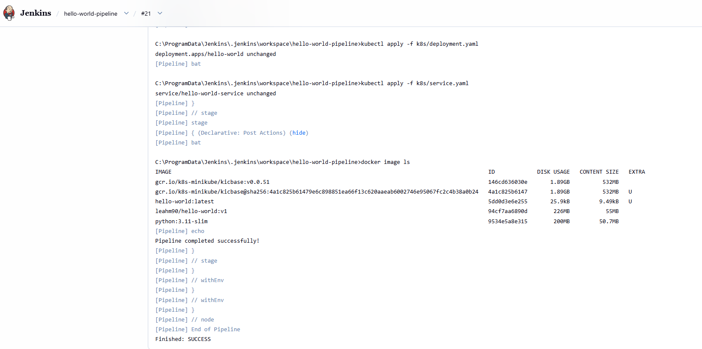

# Hello World - CI/CD & GitOps Pipeline

A simple Flask application deployed to Kubernetes through an automated Jenkins CI/CD pipeline.

## Tech Stack

Flask · Docker · Docker Hub · Jenkins · Kubernetes · GitHub

---

## 📁 Project Structure

```text
.
├── app/
│   ├── app.py
│   └── requirements.txt
├── k8s/
│   ├── deployment.yaml
│   └── service.yaml
├── screenshots/
│   └── success_build.png
├── Dockerfile
├── Jenkinsfile
└── README.md
```

---

## 🚀 Application

The application is built with Flask and provides the following endpoints:

| Endpoint  | Description     |
| --------- | --------------- |
| `/`       | Hello World     |
| `/health` | Health check    |
| `/ready`  | Readiness check |

---

## 🐳 Docker

### Build

```bash
docker build -t leahm90/hello-world:v1 .
```

### Run

```bash
docker run -p 5000:5000 leahm90/hello-world:v1
```

Open the application in your browser:

```text
http://localhost:5000
```

### Push to Docker Hub

```bash
docker login
docker push leahm90/hello-world:v1
```

---

## ☸️ Kubernetes

The application is deployed using a Kubernetes Deployment and a NodePort Service.

### Deployment

The Deployment includes:

* 2 replicas
* CPU and memory requests
* CPU and memory limits

### Deploy

Start Minikube:

```bash
minikube start --driver=docker
```

Apply the Kubernetes manifests:

```bash
kubectl apply -f k8s/deployment.yaml
kubectl apply -f k8s/service.yaml
```

### Verify Deployment

```bash
kubectl get deployments
kubectl get pods
kubectl get services
```

### Access the Application

```bash
minikube service hello-world-service
```

---

## 🔄 Jenkins CI/CD

The CI/CD pipeline is defined in the `Jenkinsfile`.

```text
GitHub
   │
   ▼
Jenkins
   │
   ├── Build Docker Image
   ├── Smoke Test
   ├── Publish to Docker Hub
   └── Deploy to Kubernetes
          │
          ▼
     Running Pods
          │
          ▼
      Hello World
```

### Pipeline Stages

| Stage          | Action                               |
| -------------- | ------------------------------------ |
| **Build**      | Build the Docker image               |
| **Smoke Test** | Verify application health            |
| **Publish**    | Push the image to Docker Hub         |
| **Deploy**     | Deploy the application to Kubernetes |

### Successful Pipeline



---

## 🔧 Prerequisites

* Python
* Git
* GitHub account
* Docker Desktop or Docker Engine
* Jenkins installed on a VM or container
* k3s or an equivalent Kubernetes runtime
* kubectl
* Minikube (optional local test path)

---

## 🚀 Deployment Instructions

### 1. Clone the Repository

```bash
git clone https://github.com/leah648/devops-course-final-project.git
cd devops-course-final-project
```

### 2. Build the Docker Image

```bash
docker build -t leahm90/hello-world:v1 .
```

### 3. Run the Application Locally

```bash
docker run -p 5000:5000 leahm90/hello-world:v1
```

### 4. Start Kubernetes

```bash
minikube start --driver=docker
```

### 5. Deploy to Kubernetes

```bash
kubectl apply -f k8s/deployment.yaml
kubectl apply -f k8s/service.yaml
```

### 6. Verify the Deployment

```bash
kubectl get pods
kubectl get services
```

### 7. Access the Application

```bash
minikube service hello-world-service
```

---

## 🛠️ Troubleshooting

### Check Pod Status

```bash
kubectl get pods
```

### Check Pod Logs

```bash
kubectl logs <pod-name>
```

### Check Service

```bash
kubectl get service hello-world-service
```

### Check Minikube Status

```bash
minikube status
```

### Restart Minikube

```bash
minikube stop
minikube start --driver=docker
```

---

## 🎯 Project Goal

This project demonstrates an end-to-end DevOps workflow:

**Source Control → CI/CD → Containerization → Docker Registry → Kubernetes Deployment**
